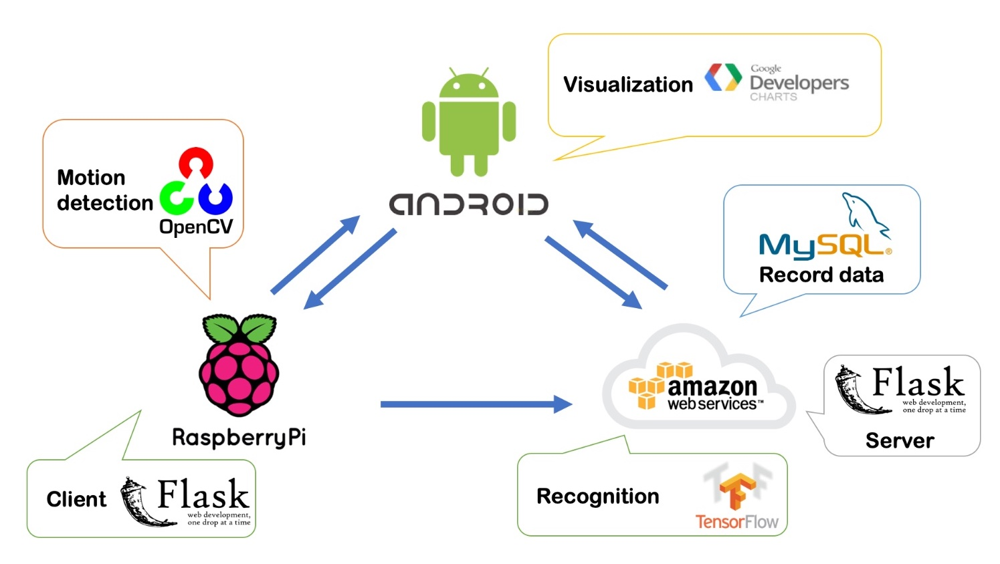
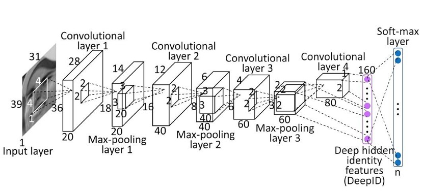
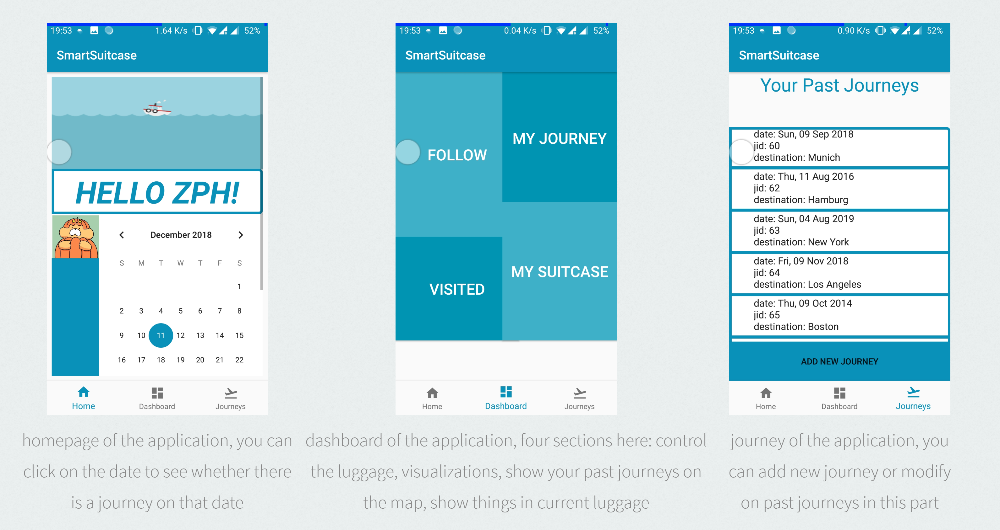
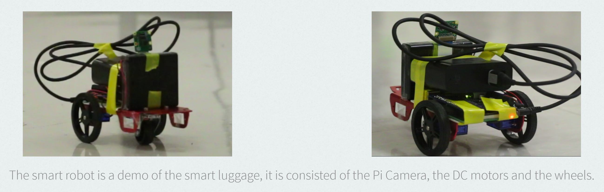
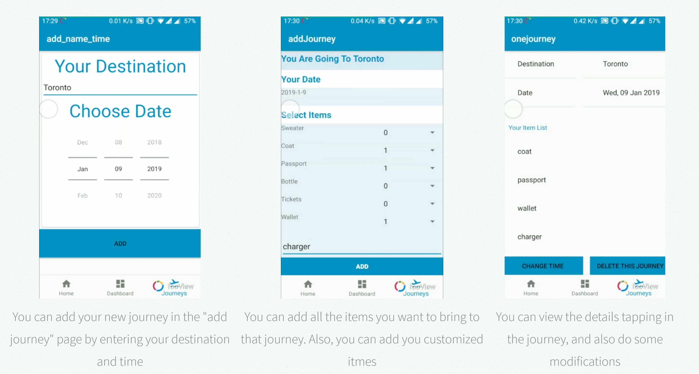
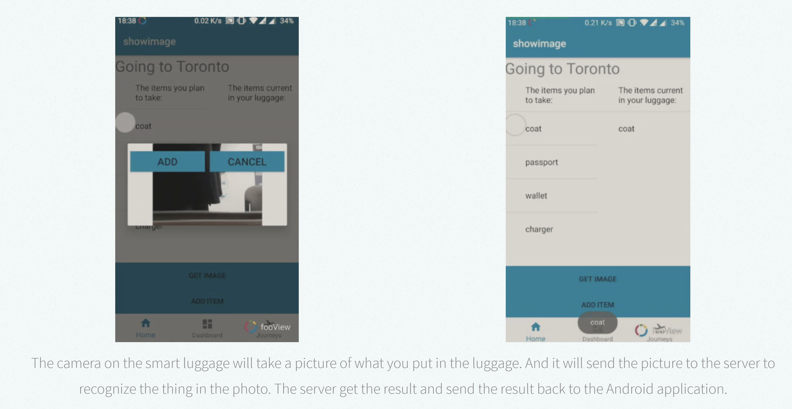
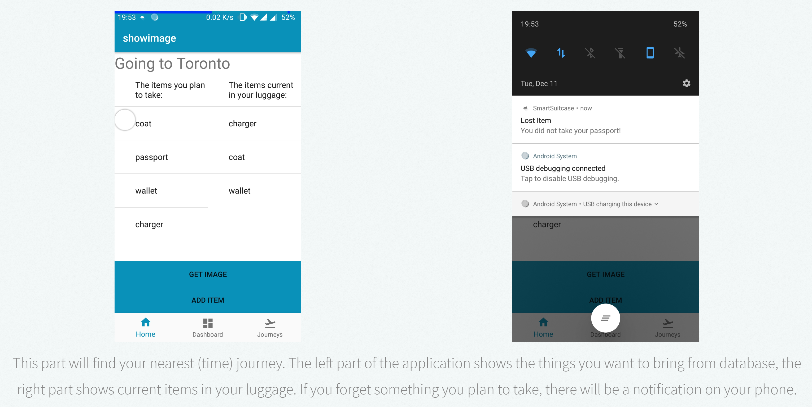
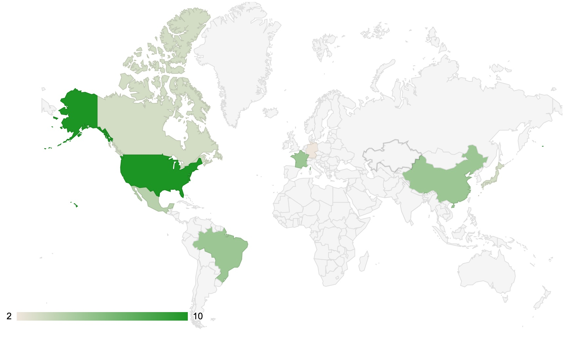
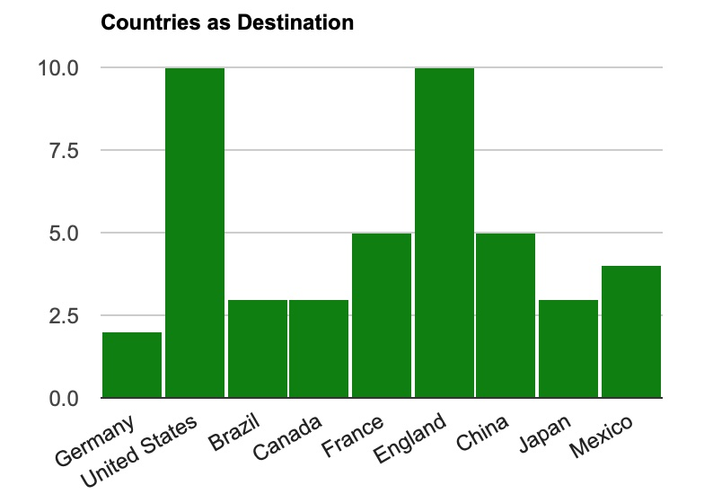

# Smart Luggage

An Internet of Things application which can relieve people during travelling!

### Team members:

Penghe Zhang, Ruochen You, Linnan Li

### Demo

### Abstract

Smart Luggage is an IoT application attached to a suitcase. It has two main parts of functionalities which can help users to manage their personal trips and let their luggages automatically follow them in the airport. 
In the first part, the trip managing part is implemented on an Andorid application, and developed it by android studio. The users can add journeys, set traveling time and manage items which are planned to take. When users are packaging their luggages, they can use camera to capture the items which they have put in the suitcase. If something important is left after finishing packing, the app will notify the user to take it. 
In the second part, we use a robot car and a motion detection procedure to drive the suitcase. In the application, when the user push the auto-driving button, the robot will use a camera to keep tracing the target item and follow it. Users can also drive the suitcase by their own via several controlling button. 
Besides, we also provide some data analysis. We make a collection of map markers to show all the place where the user has visited in. The markers shows the exact destination and date as well. A geo-map also shows the visiting frequency of different countries.

### Motivation

Smart luggage is based on a simple fact that people always suffer from heavy luggage when they go travelling or on a business trip, and there will always be some circumstances that people forget to bring some important items during their trip, maybe changes of clothes, charging cables, and even their passports which is extremely crucial for travelling. However, no one will forget to bring their phones and suitcases in the trip. Through Android application, our application can also record every places that user has travelled and by data visualization the user can directly not only see where and when that they go, but also how much times they travel to the specific countries with histogram. Therefore, with the concept of Internet of things, we decide to develop a system which connect the luggage and Android application together. So the next time, users do not have to drag heavy suitcases and will definitely have a better experience about their travel.

### System

Our IoT system can be basically divided into three parts:

1. The Raspberry Pi part, which is also the driver of the smart luggage;
2. The Android application part, which aims at helping users schedule their journeys and also checking what you have put in the luggage during packing luggages;
3. Also, there is a server part on Amazon Web Services, whose purpose is to connect all the parts together.

For instance:
When the user tap the "following" button on the Andorid application, the smart luggage will start to track with people. The raspberry pi will do detection by its camera, it will detect the motion of the users and start to track with the motivation. And send to the smart phone whether the luggage is still tracking with people or not;
During preparing journey schedule process, the android application will get all the data from the database on the server, the user can see all the past journeys and what he/she have brought on a specfic journey on the app. When a journey's date is coming near, the user will get notification from the app, and he can also start to pack his luggage. Once new items are added into the luggage, the raspberry pi will get the pictures if you put things in the luggage, and it will send the picture to the server. Then the server will do recogntion of the pictures. After getting the results of the recogntion, the server will update its database, and send a notification to the Android application, the user will get to the know what he/she has put in the luggage.

### Architecture

The connections between all the three parts is as below:

The raspberry pi will send the pictures it get to the server to do recognition, on the other hand, it will also make a connecton between the Android application for locating. 
The Android application will get all the records of the users' past journeys from the database on the server, also all new data will add to the server.
The server will serves as a bridge between all the parts, it will record all data, and also do analyzation on all data.

For the Raspberry Pi part, we use opencv to do motion detection, it is mainly based on the tracking API of opencv. Besides, we also train our own lower body haarscade data model to make our detection results more accurate. We combine both parts together, user can select what he or she want to detect on the screen. After selection, our smart robot (a replacement of luggage) will start to track with people. We also write a client on it which will help build the conncection between Android application and the smart luggage.

For the server part, we set up our database on MySQL with mainly five tables: users, luggage, journeys, schedules, items. We also built up a CNN with tensorflow to do recognition on images, our classifier can classify ten commonly used items during journeys, like coats, wallets, etc. After recognition, it will add the result to the MySQL. Also, we set up a server by Flask on it, which will help the Android application get the data in the database.

### Prototype

Android application:

Smart Luggage:

### Results

Tracking part:

Scheduling journey plans:

Packaging your luggage:

Forget something?

### Visulization

### References

1. Abaya, W. F. , Basa, J. , Sy, M. , Abad, A. C. , & Dadios, E. P. . (2015). Low cost smart security camera with night vision capability using Raspberry Pi and OpenCV. International Conference on Humanoid. IEEE.
2. Ren, S., He, K., Girshick, R., & Sun, J. (2015). Faster R-CNN: towards real-time object detection with region proposal networks. International Conference on Neural Information Processing Systems.
3. https://docs.opencv.org/3.4/d9/df8/group__tracking.html
4. https://learn.adafruit.com/adafruit-dc-and-stepper-motor-hat-for-raspberry-pi/installing-software
5. https://learn.adafruit.com/all-about-stepper-motors/driving-a-stepper
6. https://www.learnopencv.com/object-tracking-using-opencv-cpp-python/
7. https://www.pyimagesearch.com/2015/05/25/basic-motion-detection-and-tracking-with-python-and-opencv/
8. https://www.tensorflow.org/tutorials/estimators/cnn